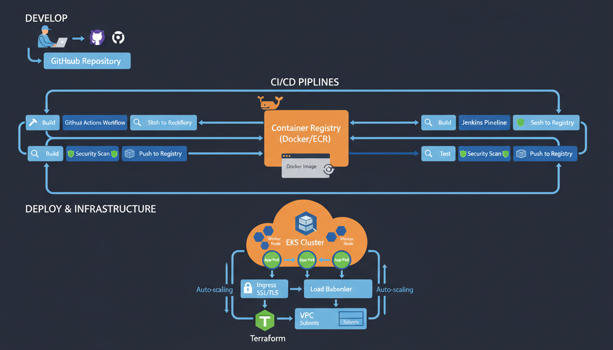
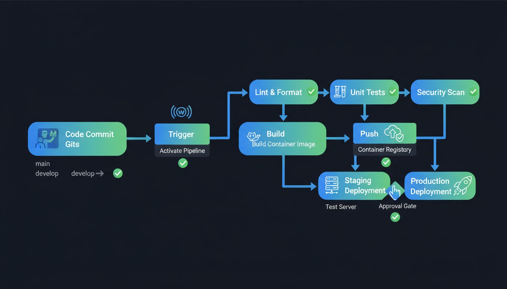

# 🚀 CI/CD Pipeline for Full-Stack Application

[](https://github.com/your-org/cicd-demo-app/actions)
[](https://www.docker.com/)
[](https://kubernetes.io/)
[](https://www.terraform.io/)

A production-ready **CI/CD pipeline** demonstrating end-to-end DevOps practices with GitHub Actions, Jenkins, Docker, Kubernetes (EKS), and Terraform.

---

## 📋 Table of Contents

- [Architecture Overview](#-architecture-overview)
- [Project Structure](#-project-structure)
- [Prerequisites](#-prerequisites)
- [Quick Start](#-quick-start)
- [CI/CD Pipeline](#-cicd-pipeline)
- [Docker Configuration](#-docker-configuration)
- [Kubernetes Deployment](#-kubernetes-deployment)
- [Terraform Infrastructure](#-terraform-infrastructure)
- [Helm Charts](#-helm-charts)
- [Monitoring & Observability](#-monitoring--observability)
- [Security Best Practices](#-security-best-practices)
- [Troubleshooting](#-troubleshooting)

---

## 🏗️ Architecture Overview



### Pipeline Flow



### Key Components

| Component | Technology | Purpose |
|-----------|------------|---------|
| **Source Control** | GitHub | Code repository & version control |
| **CI/CD** | GitHub Actions / Jenkins | Build, test, and deployment automation |
| **Containerization** | Docker | Application packaging |
| **Orchestration** | Kubernetes (EKS) | Container management & scaling |
| **Infrastructure** | Terraform | Infrastructure as Code (IaC) |
| **Package Manager** | Helm | Kubernetes application deployment |
| **Monitoring** | Prometheus + Grafana | Metrics & visualization |
| **Security** | Trivy, SonarQube | Vulnerability scanning |

---

## 📁 Project Structure

```
cicd-pipeline-project/
├── 📁 .github/
│   └── workflows/
│       ├── ci-cd-pipeline.yml    # Main GitHub Actions workflow
│       └── pr-checks.yml         # PR validation workflow
│
├── 📁 app/                       # Application source code
│   ├── server.js                 # Express.js server
│   ├── package.json              # Node.js dependencies
│   ├── Dockerfile                # Multi-stage Docker build
│   ├── .dockerignore             # Docker ignore rules
│   ├── jest.config.js            # Test configuration
│   ├── tests/
│   │   └── server.test.js        # Unit tests
│   └── public/                   # Static assets
│
├── 📁 k8s/                       # Kubernetes manifests (Kustomize)
│   ├── base/                     # Base resources
│   │   ├── deployment.yaml
│   │   ├── service.yaml
│   │   ├── ingress.yaml
│   │   ├── hpa.yaml
│   │   ├── networkpolicy.yaml
│   │   └── kustomization.yaml
│   └── overlays/                 # Environment overlays
│       ├── staging/
│       └── production/
│
├── 📁 terraform/                 # Infrastructure as Code
│   ├── main.tf                   # Main Terraform configuration
│   ├── variables.tf              # Input variables
│   ├── locals.tf                 # Local values
│   ├── helm-addons.tf            # EKS addons via Helm
│   └── environments/
│       ├── staging/
│       └── production/
│
├── 📁 helm/                      # Helm charts
│   └── cicd-demo-app/
│       ├── Chart.yaml
│       ├── values.yaml
│       └── templates/
│
├── 📁 docs/                      # Documentation
│   ├── SETUP.md
│   └── DEPLOYMENT.md
│
├── 📁 assets/                    # Images & diagrams
│   ├── architecture-diagram.png
│   └── pipeline-flow.png
│
├── Jenkinsfile                   # Jenkins pipeline
└── README.md                     # This file
```

---

## 🔧 Prerequisites

### Required Tools

| Tool | Version | Purpose |
|------|---------|---------|
| [Docker](https://docs.docker.com/get-docker/) | 20.10+ | Container runtime |
| [kubectl](https://kubernetes.io/docs/tasks/tools/) | 1.28+ | Kubernetes CLI |
| [Terraform](https://developer.hashicorp.com/terraform/downloads) | 1.5+ | Infrastructure provisioning |
| [Helm](https://helm.sh/docs/intro/install/) | 3.12+ | Kubernetes package manager |
| [AWS CLI](https://docs.aws.amazon.com/cli/latest/userguide/install-cliv2.html) | 2.13+ | AWS CLI |
| [Node.js](https://nodejs.org/) | 20.x | Local development |

### AWS Requirements

- AWS Account with appropriate permissions
- IAM user/role with EKS, EC2, VPC, and IAM permissions
- S3 bucket for Terraform state
- DynamoDB table for Terraform state locking

---

## 🚀 Quick Start

### 1. Clone the Repository

```bash
git clone https://github.com/your-org/cicd-demo-app.git
cd cicd-demo-app
```

### 2. Local Development

```bash
# Install dependencies
cd app
npm install

# Run tests
npm test

# Start development server
npm run dev
```

### 3. Build Docker Image Locally

```bash
cd app

# Build image
docker build -t cicd-demo-app:local .

# Run container
docker run -p 3000:3000 cicd-demo-app:local

# Access the app
curl http://localhost:3000/health
```

### 4. Deploy to Minikube (Local K8s)

```bash
# Start Minikube
minikube start

# Apply Kubernetes manifests
kubectl apply -k k8s/overlays/staging

# Check deployment
kubectl get pods -n staging
kubectl get svc -n staging

# Access the app
minikube service -n staging staging-cicd-demo-service
```

---

## 🔄 CI/CD Pipeline

### GitHub Actions Workflow

The main CI/CD pipeline (`.github/workflows/ci-cd-pipeline.yml`) includes:

| Stage | Description |
|-------|-------------|
| **🧪 Test** | Run unit tests with coverage |
| **🔍 Lint** | ESLint code quality checks |
| **🔒 Security** | Trivy vulnerability scanning |
| **🐳 Build** | Multi-stage Docker image build |
| **📤 Push** | Push to GitHub Container Registry |
| **🚀 Deploy** | Deploy to EKS (staging/production) |

### Pipeline Triggers

```yaml
on:
  push:
    branches: [main, develop]
  pull_request:
    branches: [main, develop]
  workflow_dispatch:
    inputs:
      environment:
        options: [staging, production]
```

### Jenkins Pipeline

The `Jenkinsfile` provides an alternative CI/CD implementation with:

- **Declarative Pipeline** syntax
- **Parallel stages** for faster builds
- **SonarQube integration** for code quality
- **Manual approval gates** for production
- **Slack notifications** for build status

---

## 🐳 Docker Configuration

### Multi-Stage Dockerfile

```dockerfile
# Stage 1: Dependencies
FROM node:20-alpine AS dependencies
WORKDIR /app
COPY package*.json ./
RUN npm ci

# Stage 2: Testing & Build
FROM node:20-alpine AS builder
COPY --from=dependencies /app/node_modules ./node_modules
COPY . .
RUN npm run lint && npm run test

# Stage 3: Production
FROM node:20-alpine AS production
RUN addgroup -g 1001 -S nodejs && adduser -S nodejs -u 1001
WORKDIR /app
COPY --from=builder --chown=nodejs:nodejs /app .
RUN npm ci --only=production
USER nodejs
EXPOSE 3000
HEALTHCHECK --interval=30s CMD curl -f http://localhost:3000/health
CMD ["node", "server.js"]
```

### Build & Push Commands

```bash
# Build with BuildKit
DOCKER_BUILDKIT=1 docker build --target production -t cicd-demo-app:latest .

# Tag for registry
docker tag cicd-demo-app:latest ghcr.io/your-org/cicd-demo-app:v1.0.0

# Push to registry
docker push ghcr.io/your-org/cicd-demo-app:v1.0.0
```

---

## ☸️ Kubernetes Deployment

### Using Kustomize

```bash
# Staging deployment
kubectl apply -k k8s/overlays/staging

# Production deployment
kubectl apply -k k8s/overlays/production

# Verify deployment
kubectl get all -n production
```

### Using Helm

```bash
# Add Helm repo (if published)
helm repo add cicd-demo https://your-org.github.io/cicd-demo-app

# Install/Upgrade
helm upgrade --install cicd-demo-app ./helm/cicd-demo-app \
  --namespace production \
  --create-namespace \
  --values helm/cicd-demo-app/values-production.yaml

# Verify
helm list -n production
kubectl get pods -n production
```

### Key Kubernetes Features

| Feature | Implementation |
|---------|---------------|
| **Auto-scaling** | HPA with CPU/Memory metrics |
| **Rolling Updates** | Zero-downtime deployments |
| **Health Checks** | Liveness, Readiness, Startup probes |
| **Security** | Network Policies, Pod Security Context |
| **Service Mesh** | Istio (optional) |

---

## 🏗️ Terraform Infrastructure

### Infrastructure Components

```
┌─────────────────────────────────────────────────────────┐
│                      AWS Cloud                          │
│  ┌─────────────────────────────────────────────────┐   │
│  │                     VPC                          │   │
│  │  ┌─────────────┐      ┌─────────────────────┐  │   │
│  │  │ Public      │      │    Private          │  │   │
│  │  │ Subnets     │      │    Subnets          │  │   │
│  │  │             │      │                     │  │   │
│  │  │ - ALB       │      │  - EKS Control Plane│  │   │
│  │  │ - NAT GW    │      │  - Worker Nodes     │  │   │
│  │  │ - Bastion   │      │  - Pods             │  │   │
│  │  └─────────────┘      └─────────────────────┘  │   │
│  └─────────────────────────────────────────────────┘   │
│                                                         │
│  - EKS Cluster (Kubernetes 1.28)                        │
│  - Managed Node Groups (t3.medium)                      │
│  - IRSA (IAM Roles for Service Accounts)                │
│  - KMS Encryption                                       │
└─────────────────────────────────────────────────────────┘
```

### Terraform Commands

```bash
cd terraform

# Initialize
terraform init

# Plan
terraform plan -var-file=environments/staging/terraform.tfvars

# Apply
terraform apply -var-file=environments/staging/terraform.tfvars

# Destroy (cleanup)
terraform destroy -var-file=environments/staging/terraform.tfvars
```

### EKS Addons Deployed

| Addon | Purpose |
|-------|---------|
| **NGINX Ingress** | HTTP/HTTPS load balancing |
| **Cert Manager** | TLS certificate automation |
| **Cluster Autoscaler** | Auto-scaling node groups |
| **External DNS** | Route53 integration |
| **EBS CSI Driver** | Persistent storage |
| **Prometheus/Grafana** | Monitoring stack |

---

## 📊 Monitoring & Observability

### Prometheus Metrics

```yaml
# ServiceMonitor configuration
serviceMonitor:
  enabled: true
  interval: 30s
  metrics:
    - http_requests_total
    - http_request_duration_seconds
    - container_cpu_usage_seconds_total
```

### Grafana Dashboards

Access Grafana at: `https://grafana.your-domain.com`

Default dashboards include:
- **Application Metrics** - Request rate, latency, errors
- **Kubernetes Metrics** - Pod status, resource usage
- **Infrastructure Metrics** - Node health, network I/O

### Logging

```bash
# View application logs
kubectl logs -f deployment/cicd-demo-app -n production

# View all pods logs
stern cicd-demo-app -n production
```

---

## 🔒 Security Best Practices

### Container Security

- ✅ **Non-root user** execution
- ✅ **Read-only root filesystem**
- ✅ **Distroless/minimal base images**
- ✅ **Security scanning** with Trivy
- ✅ **No secrets in images**

### Kubernetes Security

- ✅ **Network Policies** for traffic control
- ✅ **Pod Security Standards** (restricted)
- ✅ **RBAC** with least privilege
- ✅ **Secrets encryption** with KMS
- ✅ **IRSA** for AWS service access

### Pipeline Security

- ✅ **Dependency scanning** (npm audit, Snyk)
- ✅ **SAST** with SonarQube
- ✅ **Container scanning** with Trivy
- ✅ **SBOM generation** for traceability

---

## 🛠️ Troubleshooting

### Common Issues

#### 1. Docker Build Fails

```bash
# Clear build cache
docker builder prune -f

# Build with no cache
docker build --no-cache -t cicd-demo-app .
```

#### 2. Kubernetes Pod Not Starting

```bash
# Check pod status
kubectl describe pod <pod-name> -n <namespace>

# Check logs
kubectl logs <pod-name> -n <namespace> --previous

# Check events
kubectl get events -n <namespace> --sort-by='.lastTimestamp'
```

#### 3. Terraform Apply Fails

```bash
# Unlock state (if locked)
terraform force-unlock <LOCK_ID>

# Refresh state
terraform refresh

# Target specific resource
terraform apply -target=aws_eks_cluster.main
```

#### 4. Ingress Not Working

```bash
# Check ingress controller
kubectl get pods -n ingress-nginx

# Check ingress resource
kubectl get ingress -n <namespace>
kubectl describe ingress <ingress-name> -n <namespace>

# Check cert-manager
kubectl get certificates -n <namespace>
kubectl describe certificate <cert-name> -n <namespace>
```

---

## 📚 Additional Resources

- [GitHub Actions Documentation](https://docs.github.com/en/actions)
- [Jenkins Pipeline Documentation](https://www.jenkins.io/doc/book/pipeline/)
- [Docker Best Practices](https://docs.docker.com/develop/dev-best-practices/)
- [Kubernetes Documentation](https://kubernetes.io/docs/)
- [Terraform AWS Provider](https://registry.terraform.io/providers/hashicorp/aws/latest/docs)
- [Helm Documentation](https://helm.sh/docs/)

---

## 🤝 Contributing

1. Fork the repository
2. Create a feature branch (`git checkout -b feature/amazing-feature`)
3. Commit your changes (`git commit -m 'Add amazing feature'`)
4. Push to the branch (`git push origin feature/amazing-feature`)
5. Open a Pull Request

---

## 📄 License

This project is licensed under the MIT License - see the [LICENSE](LICENSE) file for details.

---


---

<div align="center">

**[⬆ Back to Top](#-cicd-pipeline-for-full-stack-application)**

Built with ❤️ by the DevOps Team

</div>
